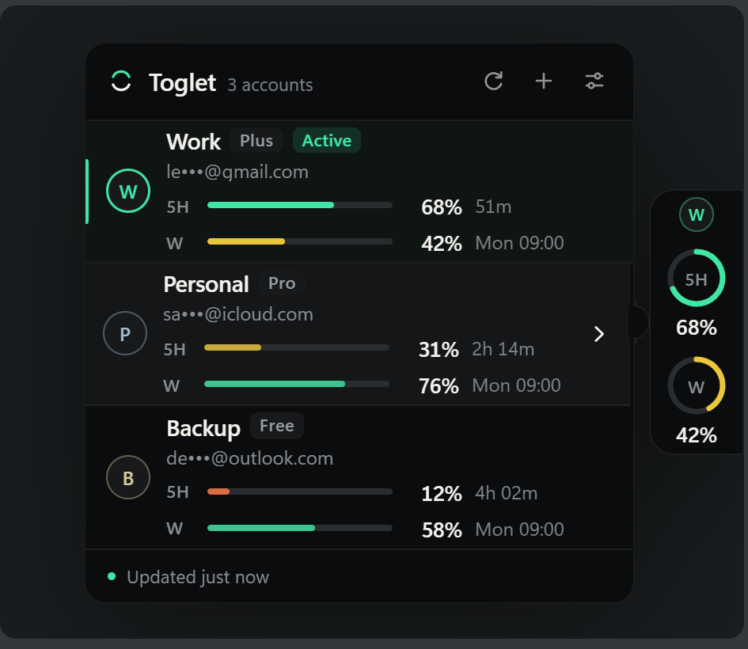
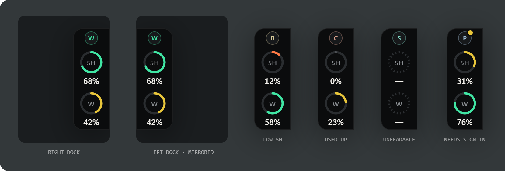
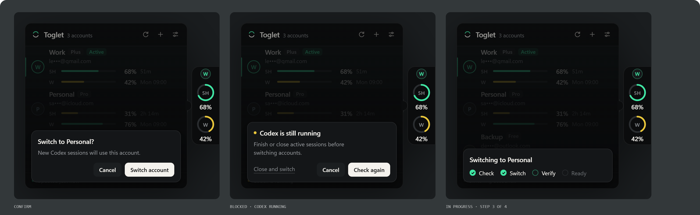
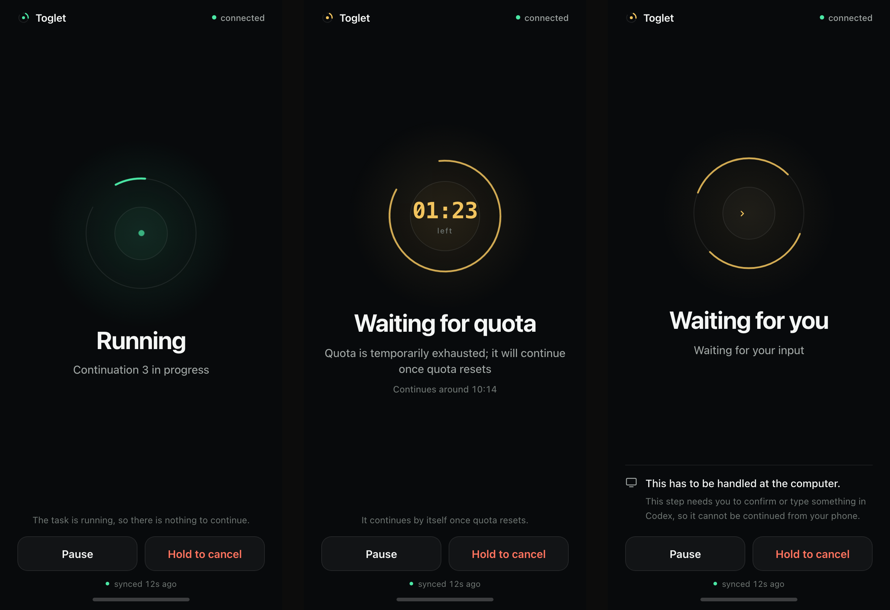

<div align="center">


# Toglet

A desktop widget for checking the quota of several Codex accounts and switching between them.

English | [简体中文](README.zh-CN.md)

[](https://github.com/leazoot/toglet/actions/workflows/ci.yml)
[](https://github.com/leazoot/toglet/releases)
[](LICENSE)

<br>



</div>

<br>

Toglet docks to the left or right edge of the screen. Collapsed, it shows the 5-hour and weekly quota of the account Codex is currently signed in as. Hover to see every account you have added, click one to switch.

It works with the [Codex CLI](https://developers.openai.com/codex/cli) and ChatGPT sign-in, on Windows and macOS.

## Features

### Quota at the screen edge

Two rings for the current account: the 5-hour window and the weekly window. A quota that could not be read, or that the server did not return, is shown as unknown rather than as 0%.



### All accounts in one panel

Add up to 12 accounts through Codex's own sign-in. The panel lists each one with its plan, masked address, both quotas and reset times. Quota for the other accounts is read in a separate temporary environment, so reading it does not touch the sign-in Codex is using.

### Manual switching

Click an account, confirm, and Toglet replaces the Codex sign-in, verifies it, and rolls back if anything fails. It asks the Codex desktop app to quit first and reopens it afterwards. If a Codex session is running in a terminal or editor, the switch waits instead of ending the process.



### Automatic continuation

Bind a Codex session to a set of backup accounts before you leave the computer. When the quota runs out, Toglet switches to the next account that still has quota and continues the same session. Off by default.

### Notifications

Get told when a continuation finishes, needs your answer, switched account or stopped. Bark, WeCom, Telegram, e-mail over SMTP, or a webhook of your own.

### Reset alerts

See when Codex last reset everyone's usage, what has been announced, and the forecast, and get told when the next one lands. Data from [Codex Resets](https://codex-resets.com). Off by default.

### Phone remote (experimental)

Continue, pause or cancel a task from your phone through a small bridge you host yourself. Still in development.



## Install

Install the [Codex CLI](https://developers.openai.com/codex/cli) and sign in with ChatGPT once, then download an installer from [Releases](https://github.com/leazoot/toglet/releases/latest).

| System                        | Package          |
| ----------------------------- | ---------------- |
| Windows 10 / 11               | `.msi` or `.exe` |
| macOS · Apple silicon / Intel | `.dmg`           |

The packages are not signed yet, so the first launch may raise a system warning.

## Usage

On first launch Toglet picks up the account Codex is signed in as. Hover the bar to open the panel and click `+` to add another account; Codex's sign-in page opens in the browser.

To switch, click an account and confirm. The progress shows four steps: check, switch, verify, ready. A failed switch restores the previous account and says what went wrong.

Settings cover the docking side, the collapsed shape (bar or rings), always on top, light and dark themes, English and Chinese, reduced motion, refresh intervals, and whether to reopen Codex after a switch. The tray menu shows the current account's quota and can hide or show the window. Removing the current account also signs Codex out.

## Automatic continuation

Open it from the panel's toolbar. Pick a session from the list, tick the backup accounts, put them in order, then turn it on.

- One session at a time. Eight continuations by default, with an optional stop-by time.
- When no backup account has quota, it waits for the first one to recover.
- It pauses when the session asks a question, and does not change the session's approval or sandbox settings.
- Every switch goes through the same verification and rollback as a manual one.
- A system notification goes out on a switch, when a round finishes, and when it needs you.

Tested on macOS. Not yet tested on Windows. The session list comes from the local Codex CLI, and an older CLI may not read newer sessions; the version in use is shown under the list.

## Notifications

Settings → Notifications. Add a channel, send a test, switch it on. With no channel configured, nothing is sent.

| Service  | What you enter                                                |
| -------- | ------------------------------------------------------------- |
| Bark     | Device key, and a server address if you host your own         |
| WeCom    | Group bot webhook address                                     |
| Telegram | Bot token and chat id, and an API address if you use a mirror |
| E-mail   | SMTP server, port, encryption, user name, password, from, to  |
| Webhook  | An address of your own that accepts a JSON `POST`             |

A message carries a title, one sentence, and at most the account's name. Addresses must be `https`, except on this machine. The details a channel needs to send are stored the same way a sign-in is, and are not shown again: editing a channel starts with empty fields, and leaving them empty keeps what is saved.

## Reset alerts

Settings → Reset alerts. Switch it on and a line above the panel's status bar shows the last reset, an announced one, or the site's forecast; a new reset goes to the desktop and to the channels you pick. While on, Toglet reads codex-resets.com every five minutes and sends nothing about your accounts.

## Phone remote (experimental)

**Experimental and still in development.** It works end to end on one machine with a local bridge, but has not been tried with a real server certificate or on a real phone yet.

Toglet has no inbound connection. Instead it polls a bridge you run, leaves its status there, and takes back at most one command. Four commands exist: continue, pause, cancel, status. Each is signed on the phone with a secret you type into both Toglet and the phone, so the bridge cannot forge one. Automatic continuation has to be on for commands to run.

Setting it up takes a server with a domain name:

1. On the server, run the installer with your domain. It unpacks into `/opt/toglet`, starts the bridge with Docker Compose behind Caddy, and prints the two addresses to pair with.

   ```sh
   curl -fsSL https://github.com/leazoot/toglet/releases/latest/download/toglet-bridge-install.sh | bash -s -- bridge.example.com
   ```

   The same file can be built from a checkout with `examples/pack.sh` and copied to the server instead.

2. Generate a secret on your own computer, for example `openssl rand -base64 24`.
3. In Toglet, Settings → Phone remote: enter the bridge address the script printed and the secret, then turn it on.
4. On the phone, open the page address the script printed, add it to the home screen, and enter the same secret.

The bridge and the phone page live in [`examples/`](examples/README.md) as reference implementations. They are not part of the Toglet build, and Toglet ships no address of its own. The bridge only relays bytes; the protocol is specified so another implementation can replace it.

## Privacy and security

Toglet runs locally, has no server and sends no telemetry. Signing in, reading quota and continuing a session all go through Codex.

Toglet makes outbound requests of its own in exactly three cases: sending a notification to a channel you configured, polling a bridge you configured, and reading the public reset status at codex-resets.com while reset alerts are on. All three are off until you set them up.

Credentials for the accounts that are not currently active are kept on this machine: encrypted with DPAPI on Windows, and in a file readable only by the current user on macOS. The login keychain is not used. Tokens, full e-mail addresses and absolute paths do not appear in logs, error messages or on screen, and there is no plaintext export.

To report a vulnerability, see [SECURITY.md](SECURITY.md).

## Development

Node.js 22+, pnpm 10, and the Rust toolchain pinned in `rust-toolchain.toml` (1.94). Some tests drive the real Codex CLI, so have it installed.

```sh
pnpm install
pnpm dev      # run the desktop app
pnpm check    # format, lint, typecheck, tests
pnpm build    # installer for this platform
```

Built with Tauri 2, React and Rust.

Friends: [LINUX DO](https://linux.do)

## License

[MIT](LICENSE)
